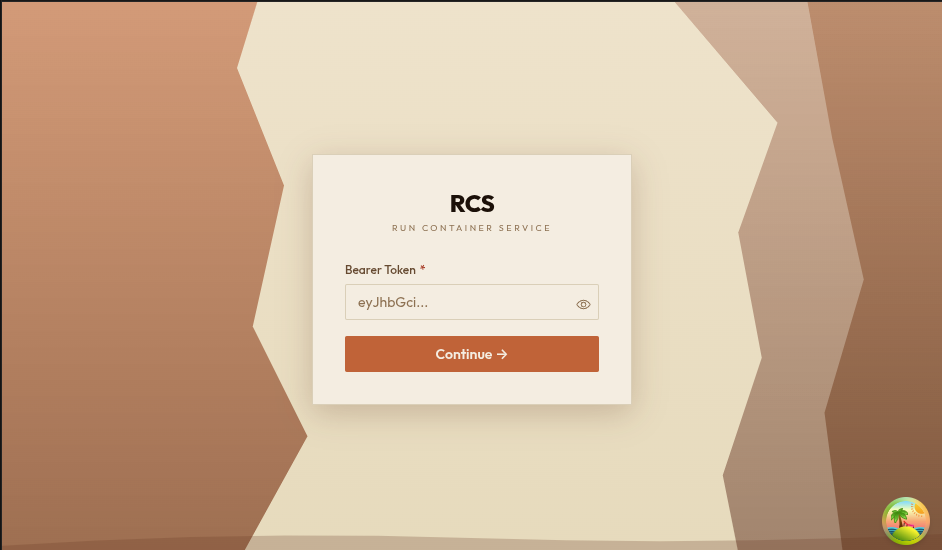

# Welcome to RCS

## What is RCS?

RCS (Run Container Service) is a web application for managing your containerized applications. It gives you a visual interface to create, monitor, update, and delete your apps - no terminal or command-line knowledge required. Everything you need is available through your browser.

---

## Key Concepts

Before you start, here are the terms you will see throughout the app.

### Cluster

A cluster is the server environment where your applications run. You can think of it as a dedicated computing platform managed by your infrastructure team. The sidebar shows which cluster you are connected to, along with a health indicator - a green dot means healthy, a red dot means something needs attention.

### Namespace

A namespace is a way to organize resources inside a cluster, similar to folders on your computer. Each team or project typically has its own namespace. Use the **Namespace** dropdown in the sidebar to filter your view to a specific namespace, or choose **All Namespaces** to see everything.

### Capp

A Capp is your application. It wraps a container image (the packaged version of your software) together with configuration for scaling, networking, logging, and storage. When you create a Capp, the system takes care of running it, keeping it healthy, and scaling it up or down as needed.

### ConfigMap

A ConfigMap is a bundle of non-sensitive settings stored as key/value pairs. Your Capps can reference ConfigMaps to read configuration values like feature flags, API endpoints, or display settings.

### Secret

A Secret is like a ConfigMap, but designed for sensitive data such as passwords, API keys, or tokens. In the RCS interface, Secret values are hidden by default - you need to click the eye icon to reveal them.

### State (Enabled / Disabled)

Every Capp has a state. **Enabled** means the application is actively running. **Disabled** means it is paused and not consuming resources. You can toggle this when creating or editing a Capp.

### Scale Metric

A scale metric is the signal the system uses to decide when to automatically add or remove copies of your application. The available options are:

- **Concurrency** - scale based on the number of simultaneous requests
- **CPU** - scale based on processor usage
- **Memory** - scale based on memory usage
- **RPS** (Requests Per Second) - scale based on incoming request rate
- **Default** - let the system decide

### Status Conditions

Status conditions are health checks that the system continuously runs on each Capp. They appear on the Capp detail page and tell you whether your application is healthy. For example, a condition might show **Ready: True** (everything is working) or **Ready: False** (something needs attention).

---

## What You Can Do

With RCS you can:

- **Browse, search, and filter** your Capps, ConfigMaps, and Secrets
- **Create** new Capps using an interactive form or by pasting YAML
- **View details** of any Capp, including its health status, container info, and configuration
- **Edit** existing Capps, ConfigMaps, and Secrets
- **Delete** resources you no longer need (with a confirmation step to prevent accidents)
- **Switch clusters** if your organization manages multiple environments
- **Filter by namespace** to focus on a specific team or project

---

## Getting Access

To use RCS, you need credentials provided by your administrator. Depending on how your team has set things up, you will sign in using one of the following methods:

- **Username and password** - the most common option for teams using Dex authentication
- **OpenShift OAuth** - a single click that redirects you to your organization's OpenShift login
- **Bearer token** - a token string provided by your admin

If you are unsure which method to use or do not have credentials yet, contact your platform or infrastructure team.
