# RCS Workflows

Step-by-step guides for every common task in RCS. UI labels you can look for on screen are shown in **bold**.

---

## 1. Signing In

1. Open the RCS URL in your browser. You will see the login screen with the **RCS** logo and **Run Container Service** heading.
2. Depending on your setup, you will see one of the following:
   - An **OpenShift OAuth** button - click it to be redirected to your organization's login page.
   - A **Username** and **Password** form - enter your credentials.
   - A **Token** field - paste the bearer token provided by your admin.
3. Click **Continue**.
4. After a successful login, you land on the **Capps** list page.

---

## 2. Navigating the Sidebar

The sidebar is always visible on the left side of the screen.

- **Top section** - Navigation links:
  - **Capps** - your applications
  - **ConfigMaps** - non-sensitive configuration bundles
  - **Secrets** - sensitive configuration bundles

- **Bottom section**  Filters and session controls:
  - **Namespace** - a dropdown to filter by namespace or select **All Namespaces**
  - **Cluster** - shows your current cluster with a health dot (green = healthy, red = issue). If multiple clusters are available, this becomes a dropdown.
  - **Disconnect** - signs you out and returns you to the login screen

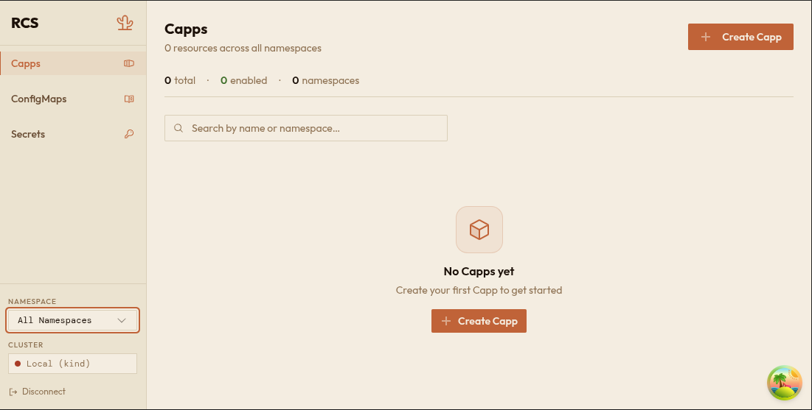

---

## 3. Creating a Capp

1. Navigate to **Capps** in the sidebar.
2. Click the **Create Capp** button in the top-right corner.
3. Enter a **Name** for your Capp (lowercase letters, numbers, and hyphens only).
4. Fill in the form sections. Each section is a collapsible panel - click the header to expand or collapse it:

   - **Details** - Choose a **Scale Metric** (how your app scales automatically) and set the **State** to **Enabled** or **Disabled**.
   - **Configuration** - Enter the **Container Image** (required). Optionally set a **Container Name** and add **Environment Variables** as key/value pairs.
   - **Route** - Set a **Hostname** if your app needs to be reachable via a URL. Choose whether **TLS** is enabled or disabled, and optionally set a **Route Timeout** in seconds.
   - **Logging** - If your app needs log forwarding, select a **Log Type** (Elasticsearch or Elasticsearch Data Stream), then fill in the **Host**, **Index** (for classic Elasticsearch), **User**, and **Password Secret Name**.
   - **Volumes** - Click **Add NFS Volume** to attach network storage. For each volume, provide a **Name**, **NFS Server** address, **Path**, and **Capacity**.
   - **Sources** - Click **Add Kafka Source** to connect event-driven scaling. For each source, provide a **Name**, **Bootstrap Servers**, and **Topics**.

5. Alternatively, click the **YAML** tab at the top to paste a complete manifest.
6. Click **Create Capp**.
7. You are taken to the detail page for your new Capp.

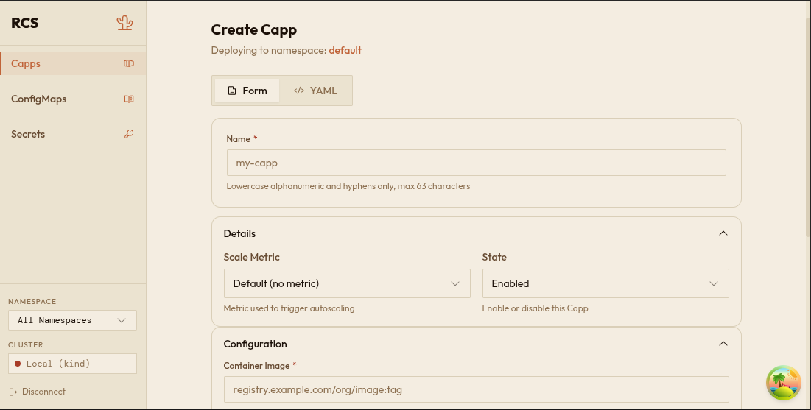

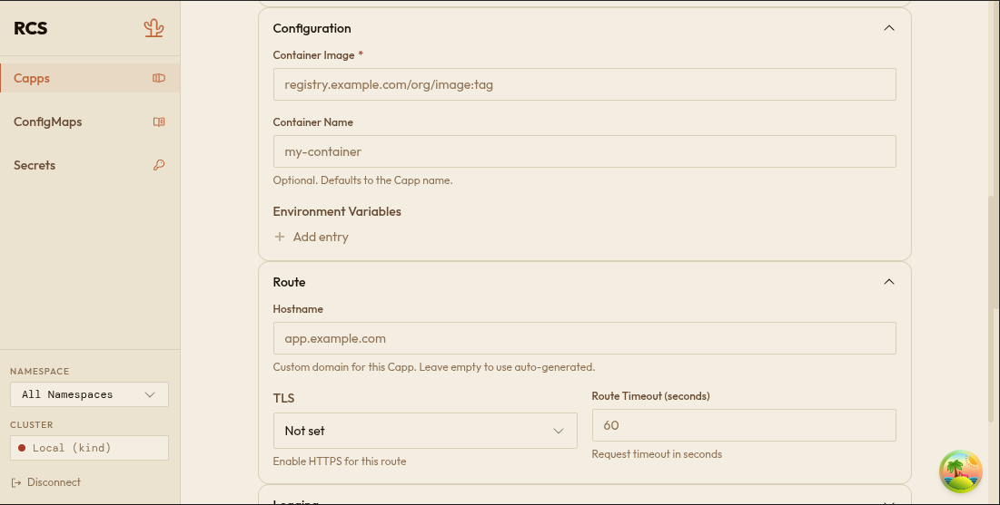

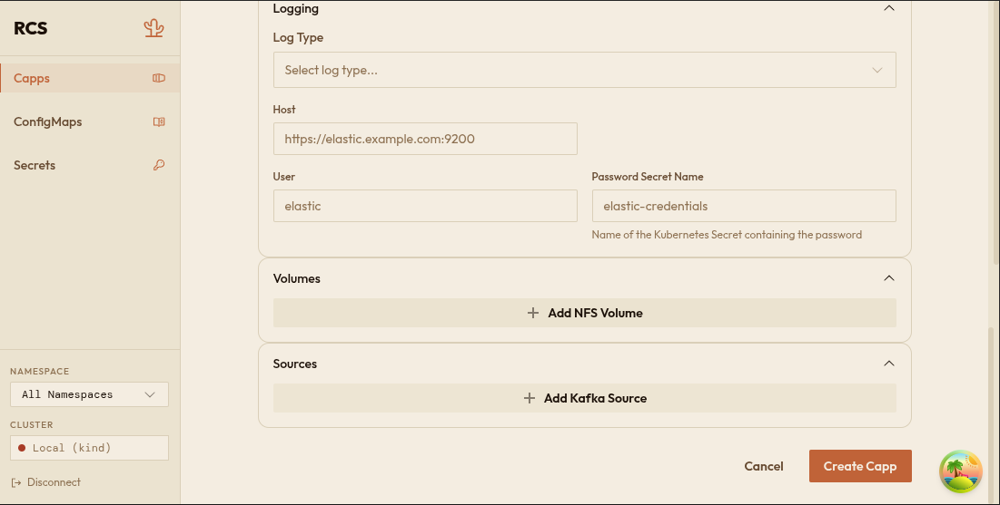

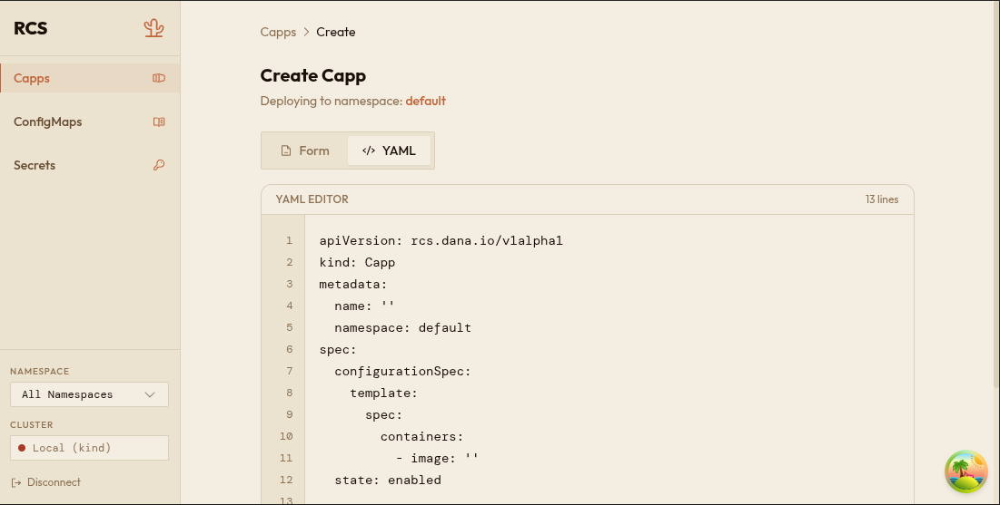

---

## 4. Viewing a Capp's Details

1. Navigate to **Capps** in the sidebar.
2. Click on the name of any Capp in the list (or use the search bar to find it).
3. The detail page shows:
   - **Overview** - Created date, scale metric, hostname (clickable link if configured), TLS status, log host, and site link.
   - **Container** - The container image (with a copy button), environment variables, and volume mounts.
   - **Status Conditions** - Health checks reported by the system. Each condition shows a type (e.g. "Ready"), a status (**True**, **False**, or **Unknown**), a reason, and when it was last updated.
   - **NFS Volumes** - If configured, shows each volume's name, server, path, and capacity.
   - **KEDA Sources** - If configured, shows event sources with their type and metadata.
4. Use the **Edit** button to modify the Capp, or the **Delete** button to remove it.

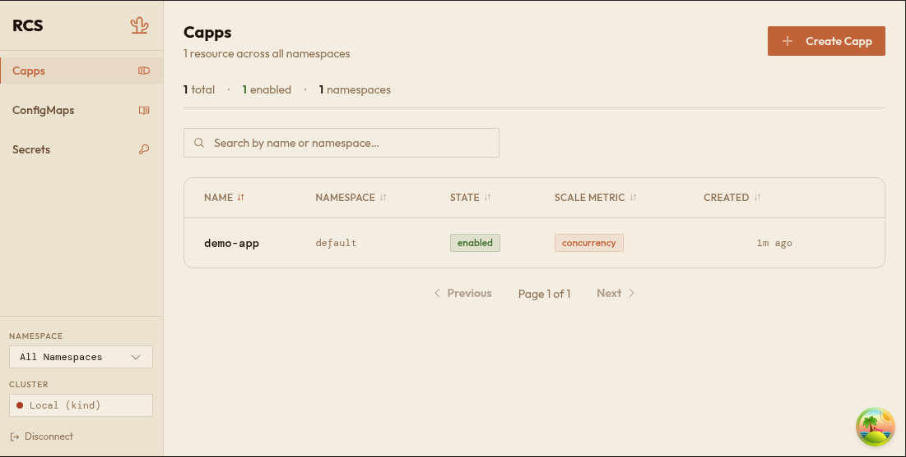

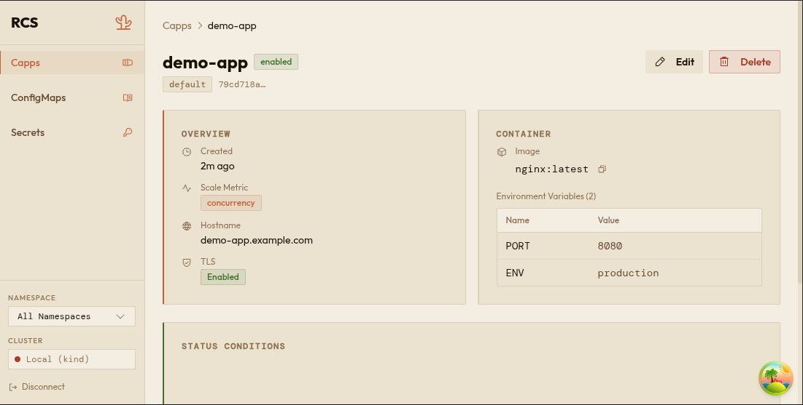

---

## 5. Editing a Capp

1. Open the Capp you want to change (see workflow 4 above).
2. Click the **Edit** button at the top of the detail page.
3. The edit form opens with the current values pre-filled. The **Name** field is locked and cannot be changed.
4. Make your changes in any of the form sections.
5. Click **Save Changes**.
6. You are returned to the detail page with the updated information.

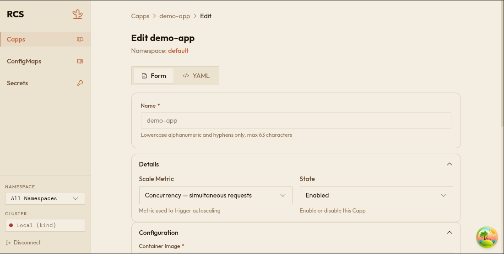

---

## 6. Deleting a Capp

You can delete a Capp from two places:

**From the list page:**
1. Hover over the Capp's row in the table.
2. Click the **trash icon** that appears on the right.

**From the detail page:**
1. Click the **Delete** button at the top.

In both cases:
3. A confirmation dialog appears: *"Are you sure you want to delete [name]? This action cannot be undone."*
4. Click **Delete** to confirm, or **Cancel** to go back.

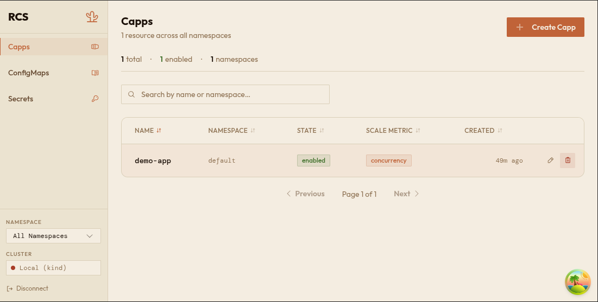

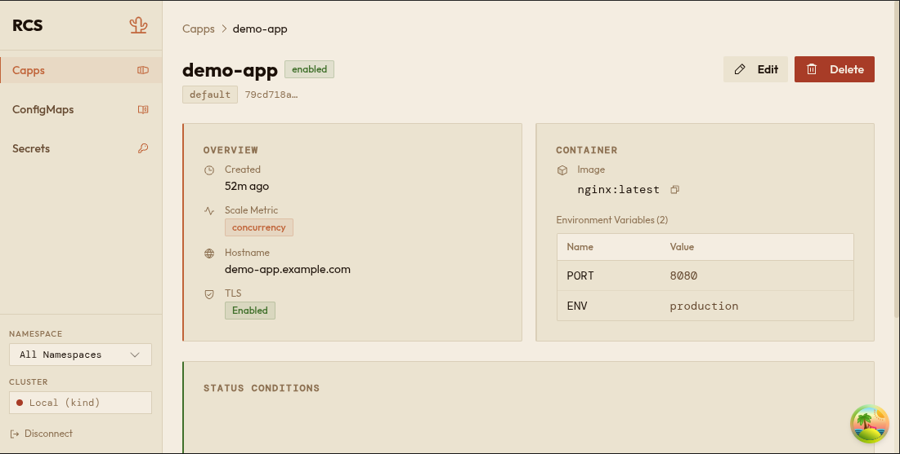

---

## 7. Managing ConfigMaps

ConfigMaps follow the same pattern as Capps - list, detail, create, edit, delete.

**Viewing ConfigMaps:**
1. Click **ConfigMaps** in the sidebar.
2. Browse the list, use the search bar, or change the namespace filter.

**Creating a ConfigMap:**
1. Click **Create ConfigMap**.
2. Enter a **Name**.
3. Click **Add entry** to add key/value pairs. Each entry has a **Key** field and a **Value** field (supports multiple lines).
4. Click **Create ConfigMap**.

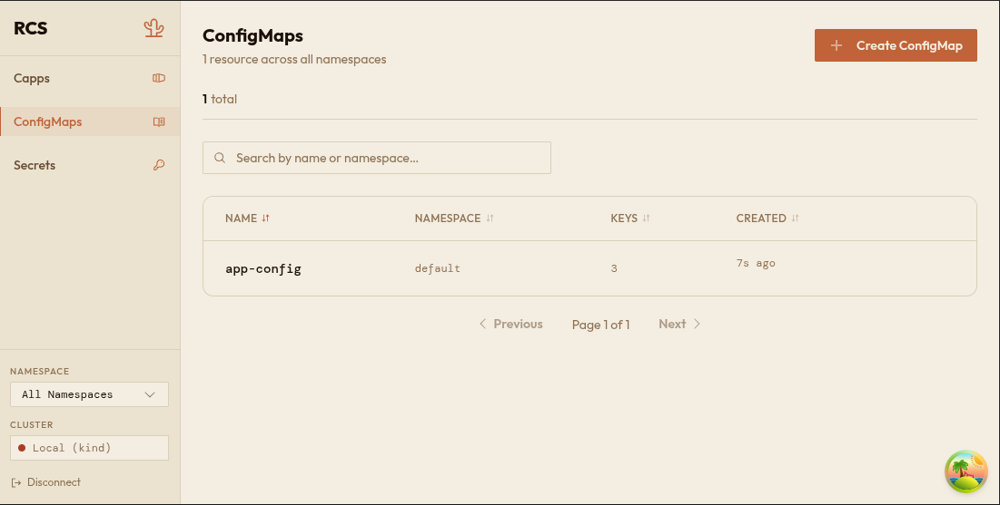

**Editing a ConfigMap:**
1. Open the ConfigMap's detail page by clicking its name.
2. Click **Edit**.
3. Add, change, or remove entries.
4. Click **Save Changes**.

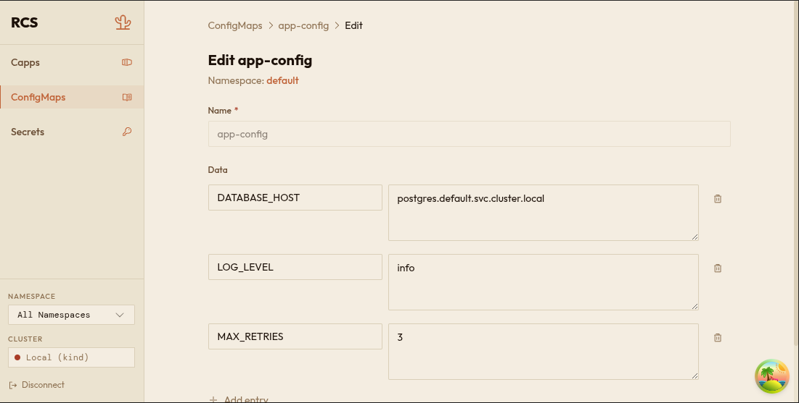

**Deleting a ConfigMap:**
1. Click the trash icon on the list row, or click **Delete** on the detail page.
2. Confirm in the dialog.

---

## 8. Managing Secrets

Secrets work like ConfigMaps with two important differences:

- **Values are hidden.** Each value is displayed as dots (••••••••). Click the **eye icon** next to any entry to reveal its value. Click again to hide it.
- **Duplicate keys are not allowed.** If you try to add two entries with the same key, the form will show a **"Duplicate key"** error and prevent you from saving.

**Creating a Secret:**
1. Click **Secrets** in the sidebar, then **Create Secret**.
2. Enter a **Name**.
3. Click **Add entry** to add key/value pairs. Values are masked as you type — use the eye icon to verify what you entered.
4. Click **Create Secret**.

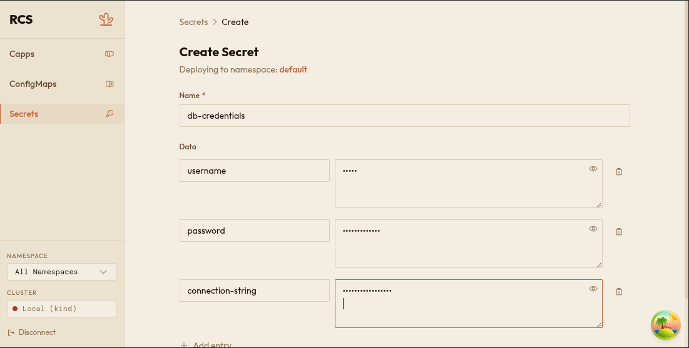

**Editing a Secret:**
1. Open the Secret's detail page and click **Edit**.
2. Modify entries as needed. Use the eye icon to reveal values before changing them.
3. Click **Save Changes**.

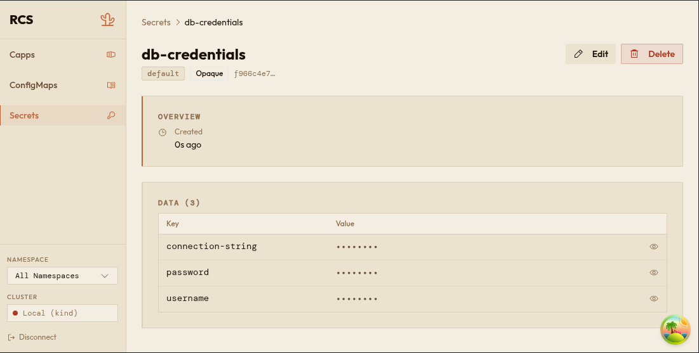

**Deleting a Secret:**
1. Click the trash icon on the list row, or click **Delete** on the detail page.
2. Confirm in the dialog.

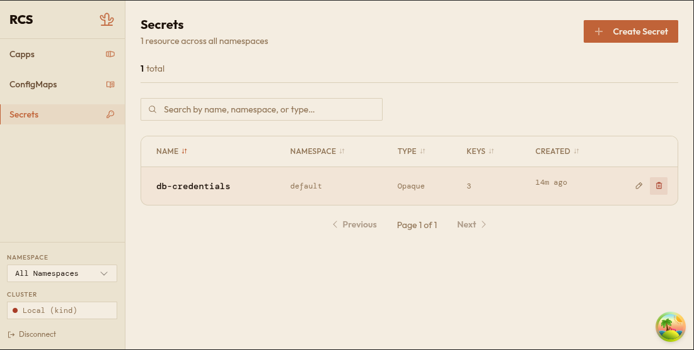

---

## 9. Switching Clusters

If your organization has multiple clusters configured:

1. Look at the bottom of the sidebar, under the **Cluster** label.
2. Click the dropdown to see all available clusters. Each cluster shows a health dot (green = healthy, red = issue) and its name.
3. Select a different cluster.
4. The **Namespace** filter automatically resets to **All Namespaces**, and the data in the current page reloads for the new cluster.

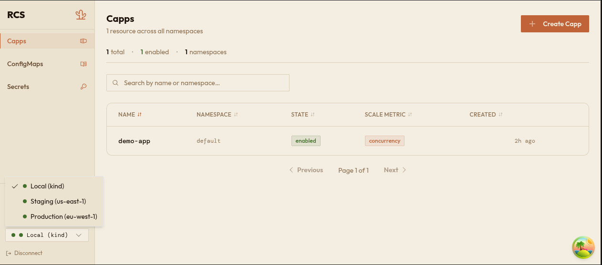

If only one cluster is configured, this section shows the cluster name and health status without a dropdown.

---

## 10. Signing Out

1. Scroll to the bottom of the sidebar.
2. Click **Disconnect**.
3. You are returned to the login screen. Your session is ended.

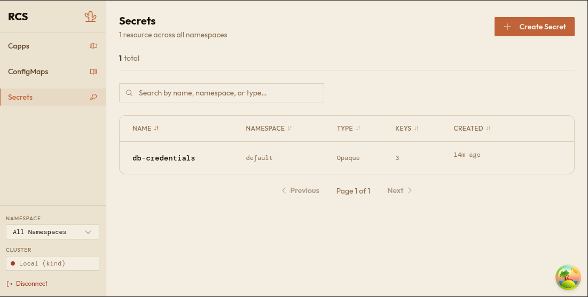

To use the app again, you will need to sign in with your credentials.
